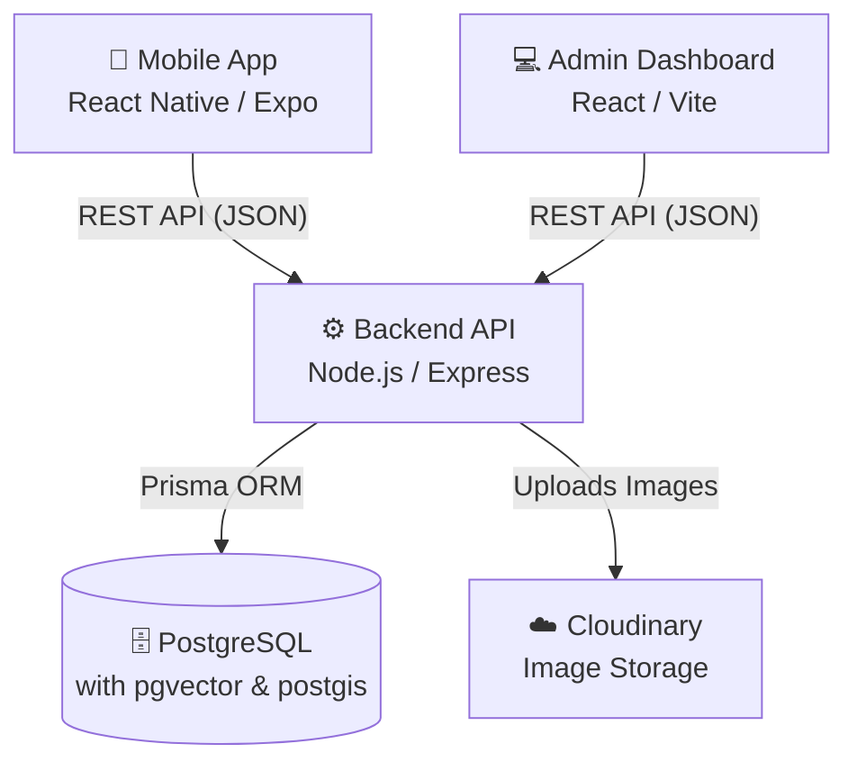

# Civic Platform

Civic Platform is a comprehensive solution designed to bridge the gap between citizens, government administrators, university officials, and industry partners. It provides a mobile application for citizens to seamlessly report civic issues and a web-based dashboard for administrators to track, manage, and resolve them efficiently.

## 🏗 Architecture & Repository Structure

The platform is structured as a **Monorepo** using [Turborepo](https://turbo.build/) and `pnpm` workspaces. This ensures efficient builds, shared dependencies, and a unified developer experience.

### System Architecture



### Workspace Breakdown

- **`apps/api`**: The backend server providing RESTful APIs. Handles authentication, database interactions, image uploads, AI processing, and core business logic.
- **`apps/mobile`**: The citizen-facing mobile application built with React Native and Expo. Allows users to capture issue photos, auto-detect locations, and track the status of their reports.
- **`rootAdminDashboardWeb`**: The web application for administrators and authorities (City Admins, Government Admins, etc.) to view analytics, manage issues via maps/queues, and monitor audit logs.

## 💻 Tech Stacks

### **Backend (`apps/api`)**
- **Node.js & Express**: Fast, lightweight, and scalable backend framework.
- **TypeScript**: Ensures type safety and reduces runtime errors.
- **Prisma ORM**: Modern, type-safe database client for seamless database interactions.
- **PostgreSQL**: Robust relational database. Utilizes `pgvector` for AI embeddings and `postgis` for geospatial data (location tracking).
- **Cloudinary**: Cloud-based image management for storing issue photos securely.
- **JWT (JSON Web Tokens)**: Secure, stateless user authentication.
- **Zod**: Schema declaration and request payload validation.

### **Mobile App (`apps/mobile`)**
- **React Native**: Cross-platform framework for building native iOS and Android apps.
- **Expo & EAS**: Simplifies React Native development, testing, and deployment.
- **React Navigation (Native Stack)**: Smooth and native-feeling screen transitions.
- **React Native Maps**: Interactive maps for pinpointing issue locations.
- **Expo Image Picker & Expo Location**: Native device APIs to capture photos and fetch GPS coordinates.

### **Admin Dashboard (`rootAdminDashboardWeb`)**
- **React 19 & Vite**: Ultra-fast frontend tooling and modern UI library.
- **TypeScript**: End-to-end type safety.
- **React Router DOM**: Client-side routing for seamless navigation.
- **Tailwind CSS**: Utility-first CSS framework for rapid and responsive styling.
- **Recharts**: Composable charting library for analytics and data visualization.
- **Leaflet & React-Leaflet**: Open-source interactive maps for visualizing reported issues geographically.
- **Lucide React**: Clean and consistent iconography.

---

## 🚀 Installation & Setup

### Prerequisites
Before you begin, ensure you have the following installed and set up:
- **[Node.js](https://nodejs.org/)** (v18 or higher)
- **[pnpm](https://pnpm.io/)** (v11+) - Used as the package manager (`npm install -g pnpm`)
- **PostgreSQL Database** - You can run this locally or use a managed service like [Supabase](https://supabase.com/) or [Neon](https://neon.tech/). Ensure the `postgis` and `pgvector` extensions are enabled.
- **[Cloudinary Account](https://cloudinary.com/)** - Create a free account to get your API keys for image uploads.
- **[Expo Go](https://expo.dev/client)** - Install on your iOS or Android device for mobile app testing.

### 1. Clone the repository
```bash
git clone <repository-url>
cd civic-platform
```

### 2. Install Dependencies
Run the following command at the root of the project to install dependencies for all workspaces simultaneously using Turborepo:
```bash
pnpm install
```

---

### 3. Backend Setup (`apps/api`)
1. Navigate to the backend directory:
   ```bash
   cd apps/api
   ```
2. Configure environment variables:
   Copy the example `.env` file and fill in your credentials.
   ```bash
   cp .env.example .env
   ```
   *Required variables typically include:*
   - `DATABASE_URL` & `DIRECT_URL` (Your PostgreSQL connection strings)
   - `CLOUDINARY_CLOUD_NAME`, `CLOUDINARY_API_KEY`, `CLOUDINARY_API_SECRET`
   - `JWT_SECRET` (A random string for token generation)
   - `PORT` (Defaults to 4000)

3. Setup Database (Prisma):
   Generate the Prisma client and push the schema to your database.
   ```bash
   # Generate Prisma Client
   pnpm prisma:generate
   
   # Apply migrations to your database
   pnpm prisma:migrate
   
   # (Optional) Seed the database with initial roles/data
   pnpm prisma:seed
   ```
4. Start the API Server:
   ```bash
   pnpm dev
   ```
   *The backend will be running at `http://localhost:4000`.*

---

### 4. Admin Dashboard Setup (`rootAdminDashboardWeb`)
1. Open a new terminal and navigate to the dashboard directory:
   ```bash
   cd rootAdminDashboardWeb
   ```
2. Configure environment variables:
   Create a `.env` file to connect the dashboard to your local API.
   ```bash
   echo "VITE_API_URL=http://localhost:4000" > .env
   ```
3. Start the Frontend Application:
   ```bash
   pnpm dev
   ```
   *The dashboard will be available at `http://localhost:3000`.*

---

### 5. Mobile App Setup (`apps/mobile`)
1. Open a new terminal and navigate to the mobile app directory:
   ```bash
   cd apps/mobile
   ```
2. Configure environment variables:
   Create a `.env` file and set the required backend endpoints or any external API keys (like Google Maps).
   ```bash
   cp .env.example .env
   # Ensure your API URL points to your local machine's IP address if testing on a physical device, e.g., EXPO_PUBLIC_API_URL=http://192.168.x.x:4000
   ```
3. Start the Expo Server:
   ```bash
   pnpm start
   
   # If you are facing network issues testing on a physical device, start with an ngrok tunnel:
   pnpm start:tunnel
   ```
4. Run on Device:
   - Make sure your phone and computer are on the same Wi-Fi network.
   - Open the **Expo Go** app on your iOS or Android device.
   - Scan the QR code displayed in your terminal.

---

## 🔗 Links & Local Endpoints

- **Backend API Base URL**: `http://localhost:4000`
- **Frontend Admin Dashboard**: `http://localhost:3000`
- **Mobile Expo Server**: Runs locally (Port varies, accessible via Expo Go QR code)

## 🛠 Useful Monorepo Commands
You can run the following commands from the **root directory** utilizing Turborepo:
- `pnpm dev` — Runs the development servers for all apps concurrently (API, Mobile, and Web).
- `pnpm build` — Builds all packages in the monorepo for production.
- `pnpm lint` — Runs TypeScript type-checking and linter across all workspaces.

---

## 📝 License
This project is licensed under the MIT License - see the [LICENSE](LICENSE) file for details.
